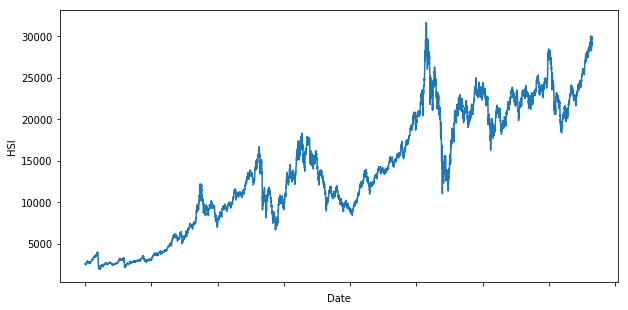
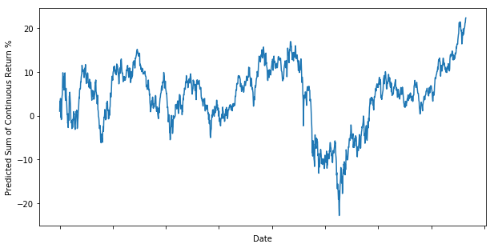

# Import


```python
from sklearn.svm import SVC
from sklearn.metrics import scorer, accuracy_score
import pandas as pd, numpy as np, matplotlib.pyplot as plt, seaborn
```

# Yahoo Historical Data from 1997 to 2017


```python
df = pd.read_csv('^HSI.csv', index_col=0).dropna()
print(df[::len(df)-1])
```

                        Open          High           Low         Close  \
    Date                                                                 
    1987-01-02   2540.100098   2540.100098   2540.100098   2540.100098   
    2017-12-29  29914.050781  29997.960938  29849.310547  29919.150391   
    
                   Adj Close        Volume  
    Date                                    
    1987-01-02   2540.100098  0.000000e+00  
    2017-12-29  29919.150391  1.365771e+09  
    

# Close Price Plot


```python
df['Close'].plot(figsize=(10,5))
plt.ylabel("HSI")
plt.show()
```





# Using Next Day Price Up Down as Target Variable


```python
y = np.where(df['Close'].shift(-1) > df['Close'], 1, -1) # up or down
```

# Predictors by OHLC


```python
df['Close-Open'] = df['Close'] - df['Open']
df['High-Low'] = df['High'] - df['Low']
X = df[['Close-Open','High-Low']]
```

# Split Train Test Data
Note train data must not include future data.  
More than 50% accuracy is profitable in the long run


```python
split_percentage = 0.8
split = int(split_percentage*len(df))
X_train = X[:split]
y_train = y[:split]
X_test = X[split:]
y_test = y[split:]
cls = SVC().fit(X_train, y_train)
accuracy_train = accuracy_score(y_train, cls.predict(X_train))
accuracy_test = accuracy_score(y_test, cls.predict(X_test))
print('Train Accuracy:{: .2f}%'.format(accuracy_train*100))
print('Test Accuracy:{: .2f}%'.format(accuracy_test*100))
```

    Train Accuracy: 92.92%
    Test Accuracy: 51.50%
    

# Continuous Return by SVC Classifier Prediction
Note not using simple return but continuous return  
Continuous return is addable as it is time consistent


```python
df['predicted'] = cls.predict(X)
df['return'] = np.log(df['Close'].shift(-1) / df['Close'])*100
df['predicted_return'] = df['return'] * df['predicted']
df['predicted_return'].iloc[split:].cumsum().plot(figsize=(10,5))
plt.ylabel("Predicted Sum of Continuous Return %")
plt.show()
```




